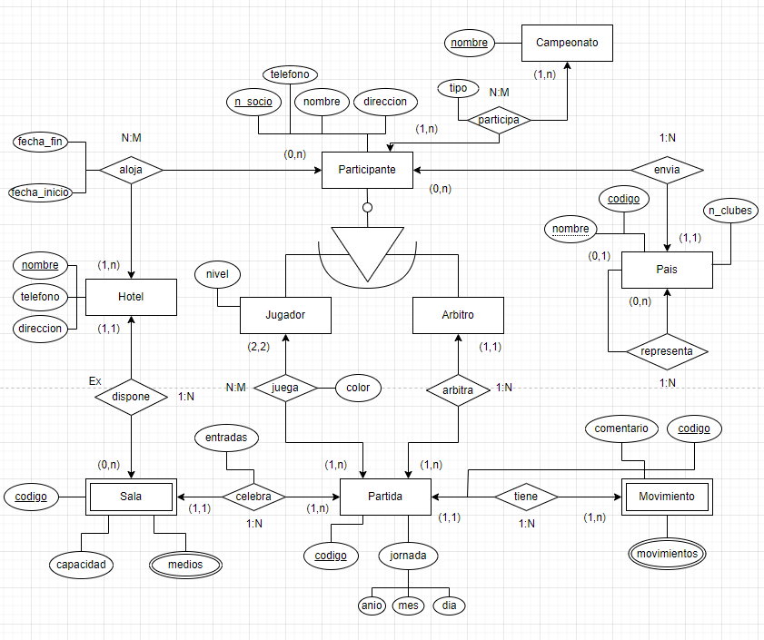

# Ejercicio 5

Se desea realizar una base de datos relacionada a la gestión de un torneo de ajedrez:

En el campeonato participan jugadores y árbitros, de ambos se requiere conocer el numero de asociado, nombre, dirección, teléfono de contacto y campeonatos en los que ha participado (como jugador o arbitro). 

De los jugadores se precisa ademas el nivel de juego en una escala de 1 a 10.

Ningún arbitro puede participar como jugador.

Los países envían al campeonato un conjunto de jugadores y árbitros, aunque no todos los países envían participantes. Todo jugador y arbitro es enviado por un único pais.

Un país puede ser representado por otro pais

Cada país se identifica por un numero correlativo según su orden alfabético e interesa conocer ademas su nombre, el numero de clubes de ajedrez existentes en el mismo.

Cada partido se identifica por un numero correlativo, la juegan dos jugadores y la arbitra un arbitro.
Interesa registrar las partidas que juega cada jugador y el color (blancas o negras) con el que juega.

Todo participante participa en al menos una partida.

Tanto jugadores como árbitros se alojan en hoteles en los que se desarrollan las partidas, se desea conocer en que hotel y en que fechas se ha alojado cada uno de los participantes.

Los participantes no tienen porque alojarse en un hotel.

De cada hotel se desea conocer el nombre, dirección y telefono.

El campeonato se desarrolla a lo largo de una serie de jornadas (año, mes, día).

Cada partida se celebra en una de las salas de los hoteles, se desea conocer el numero de entradas vendidas en la sala para cada partida.

De cada sala se desea conocer la capacidad y medios que dispone para facilitar la transmisión de los encuentros.

De cada partida, se registran todos los movimientos que la componen, la identificación de movimiento se establece en base a un numero de orden dentro de cada partida.

Para cada movimiento se guardan la jugada y un breve comentario de un experto.

  
Solución

  
  
  

[Video resolviendo el ejercicio](https://youtu.be/z5orMNEL8p0)

