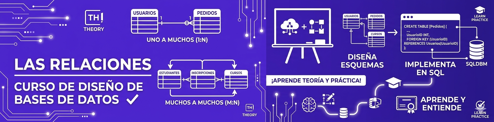
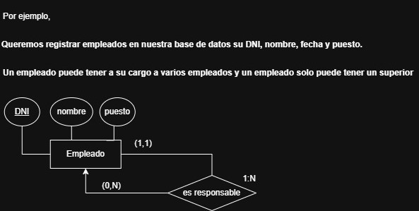

    <kbd>
        <h1><b>CURSO DE BASES DE DATOS- MÓDULO 2 DISEÑO & MODELADO DE BASES DE DATOS</b></h1>
        
        </kbd>
         
         
    <h2>04  LAS RELACIONES</h2>

## **¿ Qué son las Relaciones en "MER"?**

En el **Modelo Entidad-Relación (MER)**, las relaciones son las conexiones o asociaciones entre dos o más entidades, representadas gráficamente por un rombo en un diagrama y nombradas con un **verbo** (como **"trabaja en"**, **"suministra"**) para describir cómo interactúan, definiendo también la cardinalidad (uno a uno, uno a muchos, muchos a muchos) que especifica el número de instancias de una entidad relacionadas con otra, fundamental para el diseño de bases de datos.

 

### **Representación Gráfica:** 

* Se dibujan como un rombo en el Diagrama Entidad-Relación (DER).

 

### **Nomenclatura:**

Se nombran con verbos (ej: **`pertenece`, `escribe`, `imparte`, `parte`, `trabaja en`, `suministra`**) para clarificar la conexión.

 

### **Componentes Clave**

    Entidades: Objetos o conceptos del mundo real (ej. Alumno, Profesor, Curso).

    Atributos:** Propiedades que describen a las entidades (ej. Nombre del Alumno).

    Cardinalidad:** Define cuántas instancias de una entidad se relacionan con cuántas de otra (ej. un Alumno puede tomar muchos Cursos).

 

### **Tipos de Cardinalidad**

* **Uno a Uno `1:1`:** Una instancia de A se relaciona con una y solo una de B, y viceversa (ej. un Director dirige un solo Instituto).

* **Uno a Muchos `1:N`:** Una instancia de A se relaciona con varias de B, pero cada B se relaciona con solo una de A (ej. un Departamento tiene muchos Empleados, pero un Empleado está en un solo Departamento).

* **Muchos a Muchos `N:M`:** Varias instancias de A se relacionan con varias de B (ej. Varios Alumnos pueden estar en varios Cursos).

 

### **Importancia**

Es una herramienta esencial para el diseño lógico de bases de datos, permitiendo visualizar la estructura y las interdependencias de los datos antes de su implementación. Ayuda a identificar y resolver problemas en el diseño de bases de datos relacionales.

 
 

# **RELACIONES REFLEXIVAS EN BASES DE DATOS**

## **¿ Qué son las Relaciones Reflexivas en "MER"?**

En el **Modelo Entidad-Relación (MER)**, una **relación reflexiva (o recursiva)** es una conexión donde una misma **entidad se relaciona consigo misma**, actuando como si fueran dos entidades distintas pero en roles diferentes, como un "Empleado" que tiene un **"Superior" (otro Empleado)** o un **"Proyecto"** que contiene otros "Proyectos". Estas relaciones modelan jerarquías o estructuras internas (padre-hijo, jefe-subordinado) y se manejan en la transformación a modelo relacional creando una clave foránea dentro de la misma tabla para representar el rol.

 

### **Características clave**

**Conexión consigo misma:** 

La entidad se conecta con otra instancia de sí misma.
Roles distintos: La entidad juega dos roles diferentes en la relación (ej. "Jefe" y "Subordinado" en la entidad "Empleado").

* **Cardinalidad:** Puede ser `1:1`, `1:N` o `N:M`, y se aplica la cardinalidad a cada rol para determinar la implementación.

 

### **Ejemplos comunes**

**Empleado-Jefe:**

 *Un empleado es jefe de varios empleados, y un empleado tiene un jefe.

**Parte-Componente:** Un proyecto puede estar compuesto por otros proyectos más pequeños.

**Familia:** Una persona "es hijo de" otra persona (otra instancia de la entidad Persona).

Implementación en el Modelo Relacional

**N:M o 1:N:**

* Genera una tabla intermedia (la tabla de la relación) que contiene la clave primaria de la entidad como clave foránea (dos veces, con nombres distintos para diferenciar roles) y cualquier atributo de la relación.

* **1:1:** No siempre genera tabla; a veces se añade la clave foránea directamente a la entidad, renombrando la clave para diferenciarla.
