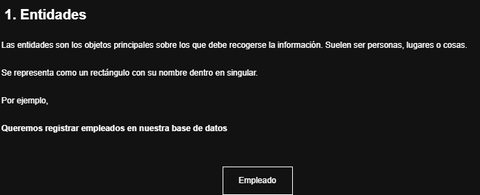

# **Curso De Bases De Datos**

## **MODÉLO ENTIDAD - RELACIÓN [MER]**

### **LAS ENTIDADES**

**¿Qué es una Entidad?**

 Son elementos distinguibles del universo de datos que forman el sistema de información, ya sean tangibles (un coche) o abstractos (una cuenta bancaria) y se representan gráficamente con rectángulos, siendo el pilar fundamental para diseñar estructuras de datos funcionales y optimizadas, identificando sus propiedades (atributos) y cómo se conectan (relaciones).

### *Esto es una entidad*

### *Propósito:*

Constituyen las futuras tablas en la base de datos, almacenando registros o instancias de esos objetos.

### *Ejemplos:*

* En una biblioteca: `"Libro", "Usuario", "Préstamo"`. 

* En una tienda: `"Cliente", "Pedido", "Artículo"`.

### *Componentes Clave del MER:*

**Entidades:** Los objetos principales (rectángulos).

**Atributos:** Las características o propiedades de una entidad (ej: para un "Cliente", sus atributos son nombre, DNI, email).

**Relaciones:** Las asociaciones entre entidades (ej: un "Cliente" realiza un "Pedido").

**Cardinalidad:** Define cuántas instancias de una entidad se relacionan con cuántas de otra (uno a uno, uno a muchos, muchos a muchos).

### *En Resumen:*

El MER es el "plano" de una base de datos, y las entidades son los "ladrillos" principales, permitiendo visualizar y diseñar cómo se estructurarán y vincularán los datos antes de su implementación física.
