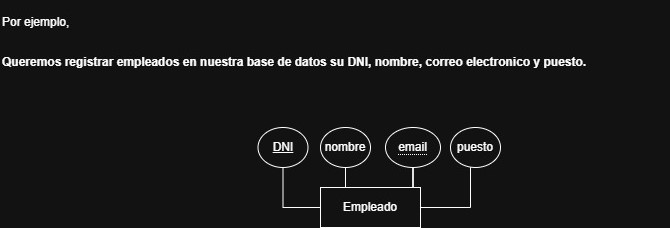

# **Curso De Bases De Datos**

## **LOS ATRIBUTOS**

# **¿Qué es un atributo?**

En un **Modelo Entidad-Relación (MER)**, un **atributo** es una **característica** o **propiedad** que describe a una **entidad** (*un objeto del mundo real, como un "Estudiante" o un "Producto"*), y se representa visualmente como un óvalo unido a la entidad. Los atributos almacenan detalles específicos (como *"Nombre", "DNI", "Email"*), y existen tipos como los clave (*identificadores,únicos, subrayados*, etc)

**LOS ATRBUTOS EN ESTA IMAGEN SON LAS PROPIEDADES REPRESENTADAS DENTRO DE LOS OBALOS**