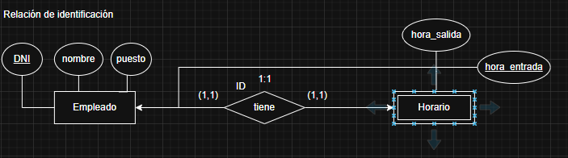
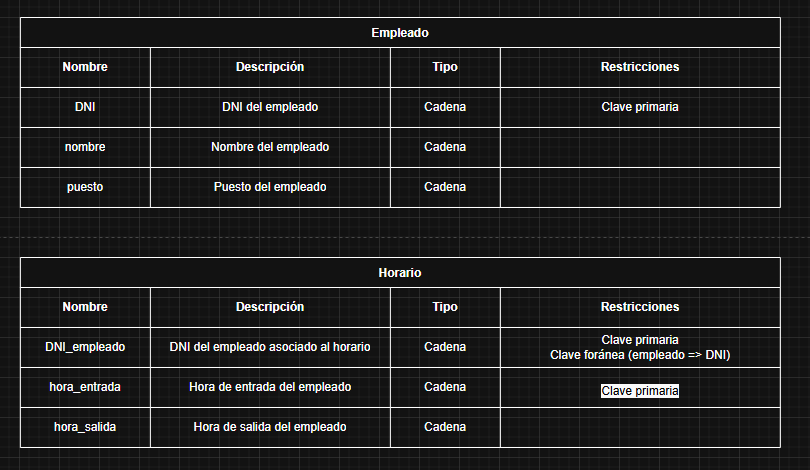

# CURSO DE BASES DE DATOS- MÓDULO 2 **DISEÑO Y MODELADO DE BASES DE DATOS**

## MODÉLO LÓGICO DE BASES DE DATOS

### ENTIDADES DEBILES

Cuando tenemos entidades débiles, se agrega la el atributo identificativo de la entidad fuerte a la tabla de la entidad débil.

Si es una relación de identificación, el atributo será identificativo y foráneo.

Si es una relación de existencia, el atributo solo será foráneo.

Por Ejemplo

### Relación de Identificación

En el formato gráfica, debemos subrayar el nuevo atributo de la entidad débil y apuntar al atributo original.

En el formato de tabla, añadimos el nuevo atributo e indicamos sus restricciones.

### Relación de Existencia

En el formato gráfica, apuntamos el nuevo atributo al atributo original.

En el formato de tabla, añadimos el nuevo atributo e indicamos sus restricciones.En el formato de tabla, añadimos el nuevo atributo e indicamos sus restricciones.

