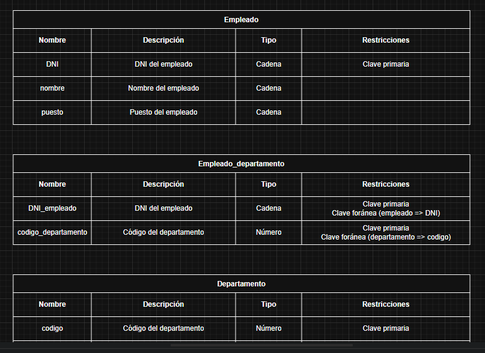

# CURSO DE BASES DE DATOS- MÓDULO 2 **DISEÑO Y MODELADO DE BASES DE DATOS**

## MODÉLO LÓGICO DE BASES DE DATOS

### CARDINALIDAD N:M

Cuando tenemos una cardinalidad N:M entre dos entidades, se crea una nueva tabla con los atributos identificativos de ambas entidades.

Ambos atributos serán identificativos de la nueva tabla, además de ser claves foráneas.

En el caso de que la relación tenga atributos, se añadirán a la nueva tabla como atributos normales.

Por Ejemplo

En el formato gráfica, añadiremos una nueva tabla, puedes llamarla como quieras, lo habitual suele ser combinar ambas entidades.

En el formato tabla, añadiremos una nueva tabla indicando en sus atributos sus restricciones.

Cuando tenemos dos atributos identificativos, no pueden haber dos registros repetidos en la nueva tabla.Cuando tenemos dos atributos identificativos, no pueden haber dos registros repetidos en la nueva tabla.

Por ejemplo, no podemos tener que el mismo empleado esta en el mismo departamento 2 o más veces.

Pero, ¿y si tuvieramos que repetirlo varias veces? 

Por ejemplo, en nuestro caso, que un empleado pueda ingresar en un departamento, varias veces indicando la fecha de ingreso.

Con lo que hemos hecho antes, el empleado no puede estar en un mismo departamento varias veces en diferentes fechas.

Para solucionar esto, crearemos un nuevo atributo, que será el identificativo, y las claves de las otras entidades pasaran a ser solo foráneas.

Esto no es siempre es necesario, según las necesidades del diseño es recomendable usarlo o no.

En una Tabla

Otra opcion valida, es hacer que la fecha sea identificativa junto a las claves que nos traemos de las otras entidades.

En una tabla

