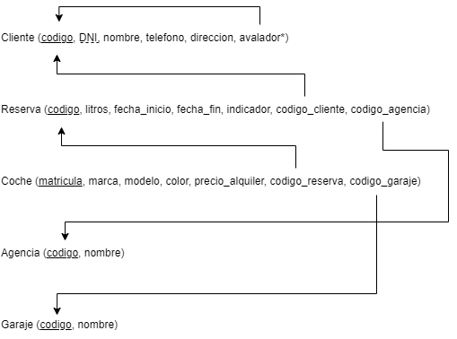
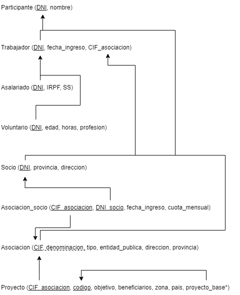

[Video completo](https://youtu.be/OXlTszMSdIo)

# Ejercicio 1

  
Solución en formato tabla

  
  
  

  
Solución en formato grafica

  
  
  

[Video resolviendo el ejercicio](https://youtu.be/Gw1HigGDSMI)

# Ejercicio 2

  
Solución en formato tabla

  
  
  

  
Solución en formato grafica

  
  
  

[Video resolviendo el ejercicio](https://youtu.be/W2bqjG4tr_8)

# Ejercicio 3

  
Solución en formato tabla

  
  
  

  
Solución en formato grafica

  
  
  

[Video resolviendo el ejercicio](https://youtu.be/PJ45lGg_Ryg)

# Ejercicio 4

  
Solución en formato tabla

  
  
  

  
Solución en formato grafica

  
  
  

[Video resolviendo el ejercicio](https://youtu.be/O28-SojFhK0)

# Ejercicio 5

  
Solución en formato tabla

  
  
  

  
Solución en formato grafica

  
  
  

[Video resolviendo el ejercicio](https://youtu.be/aqLQxQuscwk)
